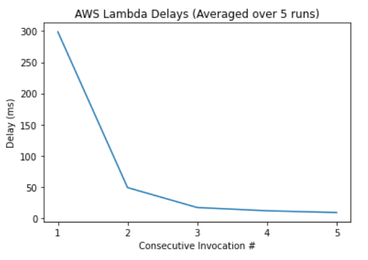
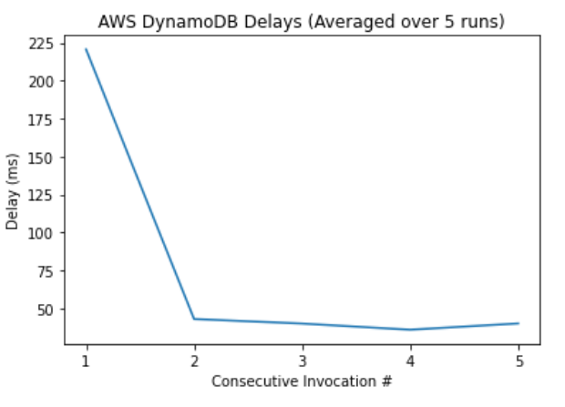

# Testing AWS Cold Start delays
In this repository, the cold start delays for AWS Lambda and AWS DynamoDB are tested.

In the above charts, each data point represents the average delay of that measurement point over 5 separate trials.

## Method
Each trial is a series of 5 consecutive invocations to a specific resource, with the first invocation being a cold start.

Each trial is obtained by doing the following:
- For AWS Lambda delays, an [invoker lambda](lambdas/invoker.py) was used to automate each trial to ensure consistency. The [invoker lambda](lambdas/invoker.py) calls the REST API of the [test lambda](lambdas/lambda-delay.py) 5 times consecutively with 1 second in between calls, after which the [test lambda](lambdas/lambda-delay.py) response time is read from AWS X-Ray.

- For AWS DynamoDB delays, the [DB test lambda](lambdas/dynamoDB-delay.py) is ran, printing timestamps before and after a `dynamodb.Table.put_item()` call. The response time for DB is obtained by subtracting these two timestamps. This is also done 5 times, with 1 second delay in between.

5 trials were obtained, with over 6 hours between each trial to ensure the resource had sufficient time to cool down. Each data point was averaged over the trials to obtain the values graphed above.

The Matplotlib library was used to plot the graphs, the plotting code can be found in [delay-graphs.ipynb](delay-graphs.ipynb).